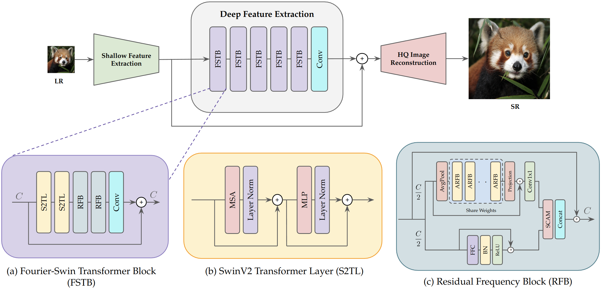
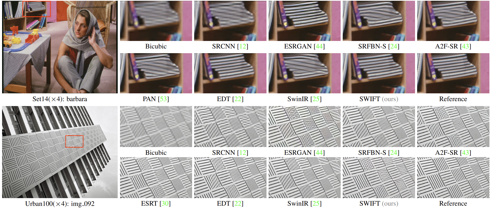
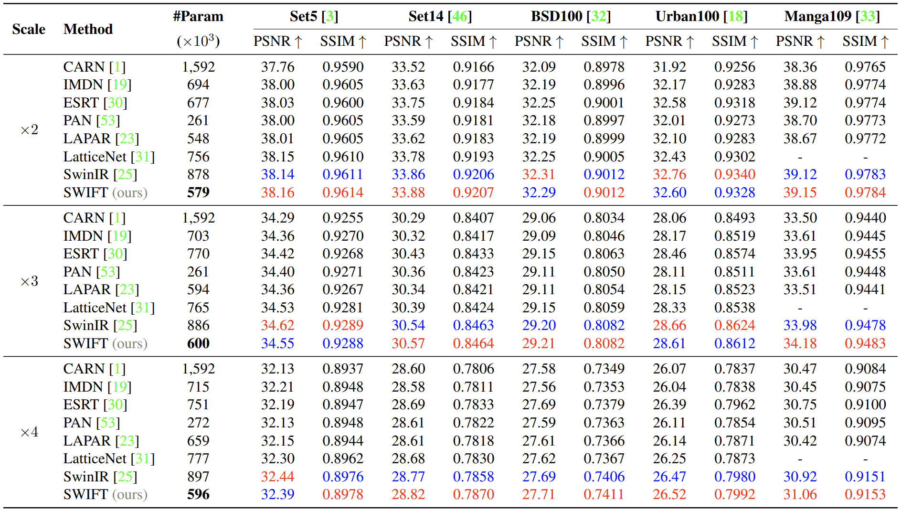
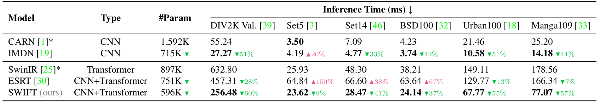

# SWIFT

[Vishal Ramesha](https://github.com/iVishalr), [Abhishek Aditya BS](https://github.com/Abhishek-Aditya-bs), [Yashas Kadambi](https://github.com/Yashas120), [T Vijay Prashant](https://github.com/tvijayprashant), [Shylaja S S](https://scholar.google.co.in/citations?user=X365OjgAAAAJ&hl=en)

[[Paper]](#)

This repository contains the official implementation for the paper titled _"Towards Faster and Efficient Lightweight Image Super Resolution using SwinV2 Transformers and Fourier Convolutions"_.

## SWIFT for Lightweight Image Super Resolution

<p float="left" align="center" padding="300px">
  
</p>

<p align="justify">
<i>Lightweight Single Image Super Resolution in recent times has seen lot of advances. Transformer based methods have achieved great improvements over CNN-based methods. This is mainly driven by transformer's ability to effectively model long-range dependencies in images. However, transformer based approaches have lot of parameters and are computationally expensive during inference. In this work, we propose SWIFT, a hybrid of Swin transformers and Fast Fourier Convolutions (FFC). SWIFT consists of three stages: shallow feature extraction, deep feature extraction and high-quality image reconstruction. Deep feature extraction consists of SwinV2 transformer blocks extended with Attention Scaling and our novel Residual Frequency Blocks (RFB) to effectively extract high frequency details and model long-range dependencies. Experimental results on popular benchmarking datasets shows that SWIFT outperforms state-of-the-art methods like SwinIR in the realm of lightweight SISR while using 33.55% less parameters and being upto 60% faster during inference.</i>
</p>

## Contents

1. [Training](#training)
2. [Testing](#testing)
3. [Predictions](#predictions)
4. [Docker](#docker)
5. [Swift Inference using TorchServe](#swift-inference-using-torchserve)
6. [Results](#results)

## Training

We use the [DIV2K](https://cv.snu.ac.kr/research/EDSR/DIV2K.tar) dataset (800 images) for training the model. We also experiment with training models on DF2K (DIV2K + [Flickr2K](https://cv.snu.ac.kr/research/EDSR/Flickr2K.tar)). The model scores reported in the paper and the released checkpoints for the model use only DIV2K for training.

`train.py` is the main training file used for training the model. The model has been trained for 700K iterations in total for each of 2x, 3x, and 4x scales. Methods like SwinIR, SwinFIR train 2x model from scratch and fine-tune for 3x and 4x scales. However, in our work we train all the models from scratch.

Structure of dataset is used in our work is as shown below,

```bash
- Datasets
|__DIV2K
   |__DIV2K_train_HR
   |  |__HR
   |     |__0001.png
   |     |__0002.png
   |     |
   |     |__0800.png
   |__DIV2K_train_LR_bicubic
      |__X2
      |  |__0001x2.png
      |  |__0002x2.png
      |  |
      |  |__0800x2.png
      |__X3
      |  |__0001x3.png
      |  |__0002x3.png
      |  |
      |  |__0800x3.png
      |__X4
         |__0001x4.png
         |__0002x4.png
         |
         |__0800x4.png
```

The different training options that `train.py` provides is shown below

```console
$ python3 train.py --help
usage: train.py [-h] [--lr float] [--n_epochs int] [--batch_size int] [--test_batch_size int] [--gamma int] [--step_size int] [--root str] [--n_train int] [--n_val int] [--cuda] [--threads int] [--amp] [--load_mem] [--ckpt_dir str]
                [--start_epoch int] [--log_every int] [--test_every int] [--save_every int] [--pretrained str] [--resume str] [--scale int] [--patch_size int] [--rgb_range int] [--n_colors int] [--seed int] [--show_metrics] [--ext str]
                [--model str]

Towards Faster and Efficient Lightweight Image Super Resolution using Swin Transformers and Fourier Convolutions

options:
  -h, --help            show this help message and exit
  --lr float            Learning rate for training. Default=2e-4
  --n_epochs int        Number of epochs to train model. By default model trains till 700K iterations.
  --batch_size int      Batch size to use for training. Default=64
  --test_batch_size int
                        Batch size to use for validation. Default=1
  --gamma int           Learning rate decay factor. Default=0.5
  --step_size int       learning rate decay per N epochs
  --root str            Path to root of dataset directory.
  --n_train int         Number of samples in training set. Default=800
  --n_val int           Number of images in validation set. Default=1
  --cuda                Use CUDA enabled devices for training
  --threads int         Number of workers for dataloader. Default=12
  --amp                 Enables Automatic Mixed Precision for training.
  --load_mem            Loads entire dataset to RAM.
  --ckpt_dir str        Path to model checkpoint directory.
  --start_epoch int     Epoch number to resume training.
```

To train SWIFT, please type the following commands in terminal

```bash
python3 train.py --scale=2 --patch_size=128 --root=<path_to_Dataset> \
--lr=2e-4 --n_epochs=100000 --batch_size=64 --threads=8 --n_train=800 \
--ckpt_dir="./experiment" --log_every=100 --test_every=1000 \
--save_every=2000 --cuda --amp --load_mem --model="SWIFTx2"
```

The above command trains the model for x2 scale on random patches of size 128 x 128. To train for x3 and x4, `--scale` must be set to 3 or 4 and `--patch_size` must be 192 (for x3) and 256 (for x4).

SWIFT uses tensorboard for storing all training metrics and predictions on images. Tensorboard can be launched by typing the following command in a new terminal.

```bash
tensorboard --logdir=runs --bind_all
```

We use a single NVIDIA TESLA A100 GPU for training the models.

## Testing

We perform validation on Set5 dataset during training. We test the effectiveness of SWIFT on popular benchmarking datasets like Set5, Set14, BSD100, Urban100 and Manga109. `test.py` script was used to obtain the scores reported in paper. This script performs inference of SWIFT model on the benchmarking dataset.

To execute the testing script, type the following command in terminal

```bash
# x2 scale
python3 test.py --scale=2 --patch_size=128 --model_path="./model_zoo/SWIFT/SWIFT-S-2x.pth" --cuda
# x3 scale
python3 test.py --scale=3 --patch_size=192 --model_path="./model_zoo/SWIFT/SWIFT-S-3x.pth" --cuda
# x4 scale
python3 test.py --scale=4 --patch_size=256 --model_path="./model_zoo/SWIFT/SWIFT-S-4x.pth" --cuda
```

Other options provided by the `test.py` are shown below

```console
$ python3 test.py --help
usage: test.py [-h] --scale int --model_path str [--batch_size int] [--cuda] [--jit] [--forward_chop] [--seed int] [--summary]

Towards Faster and Efficient Lightweight Image Super Resolution using Swin Transformers and Fourier Convolutions

options:
  -h, --help        show this help message and exit
  --scale int       Super resolution scale. Scales: 2, 3, 4.
  --model_path str  Path to the trained SWIFT model.
  --batch_size int  Batch size to use for testing. Default=1.
  --cuda            Use CUDA enabled device to perform testing.
  --jit             Perform inference using JIT.
  --forward_chop    Use forward_chop for performing inference on devices with less memory.
  --seed int        Seed for reproducibility.
  --summary         Print summary table for model.
```

`test.py` script does not store the predictions in files. Please see the next section for storing the results from SWIFT. Using `--forward_chop` redcues memory consumption but results in lower PSNR and SSIM scores compared to the reported scores.

## Predictions

If you want to use SWIFT to get predictions on the benchmarking datasets or on custom images, use `predict.py` script instead of `test.py` script. `predict.py` script stores the results of predictions in `results/` folder.

If you have both LR (low resolution) and HR (high resolution) image pairs, then execute the following command in terminal,

```bash
# for x2
python3 predict.py --scale=2 --training_patch_size=128 --model_path="./model_zoo/SWIFT/SWIFT-S-2x.pth" --folder_lq=<path_to_LR_image_folder> --folder_gt=<path_to_HR_image_folder> --cuda
# for x3
python3 predict.py --scale=3 --training_patch_size=192 --model_path="./model_zoo/SWIFT/SWIFT-S-3x.pth" --folder_lq=<path_to_LR_image_folder> --folder_gt=<path_to_HR_image_folder> --cuda
# for x4
python3 predict.py --scale=4 --training_patch_size=256 --model_path="./model_zoo/SWIFT/SWIFT-S-4x.pth" --folder_lq=<path_to_LR_image_folder> --folder_gt=<path_to_HR_image_folder> --cuda
```

Passing both HR and LR images will calculate the PSNR and SSIM scores using HR images as ground truth.

If you only have LR images and would like to get the SWIFT super resolved images, type the following command in terminal,

```bash
python3 predict.py --scale=4 --training_patch_size=256 --model_path="./model_zoo/SWIFT/SWIFT-S-4x.pth" --folder_lq=<path_to_LR_image_folder> --cuda
```

_Note that in the above command, the path to HR folder is omitted._

Optionally, you can use `--jit` flag to compile the model using JIT which speeds up inference time. If you have less memory for inference, use `--forward_chop` flag to reduce memory consumption.

The complete list of options provided by `predict.py` script is shown below

```console
$ python3 predict.py --help
usage: predict.py [-h] --scale int --model_path str --folder_lq str [--folder_gt str] [--tile int] [--tile_overlap int] [--cuda] [--jit] [--forward_chop] [--summary]

Towards Faster and Efficient Lightweight Image Super Resolution using Swin Transformers and Fourier Convolutions

options:
  -h, --help          show this help message and exit
  --scale int         Super resolution scale. Scales: 2, 3, 4
  --model_path str    Path to the trained SWIFT model.
  --folder_lq str     Path to low-quality (LR) test image folder.
  --folder_gt str     Path to ground-truth (HR) test image folder. (Optional)
  --tile int          Tile size, None for no tile during testing (testing as a whole)
  --tile_overlap int  Overlapping of different tiles
  --cuda              Use CUDA enabled device for inference.
  --jit               Perform inference using JIT.
  --forward_chop      Use forward_chop for performing inference on devices with less memory.
  --summary           Print summary table for model.
```

## Docker

If you want to test out SWIFT, we provide a docker image that comes with all the dependencies pre-installed. The image can be run on both CPU and CUDA enbaled GPU. To run on GPU, please refer to the [installation guide](https://docs.nvidia.com/datacenter/cloud-native/container-toolkit/install-guide.html).

### Run SWIFT using prebuilt images

To run SWIFT training image, type the following command in terminal

To run on CPU,

```bash
docker run --rm -p 6006:6006 -it ivishalr/swift-training:latest bash
```

To run on GPU,

```bash
docker run --rm --gpus all -p 6006:6006 -it ivishalr/swift-training:latest bash
```

Note: The above image will be pulled from DockerHub and requires internet connection.

### To build image from scratch

Use the following command to build docker image from scratch

```bash
docker build -t swift:0.1 -f docker/swift.dockerfile .
```

### To run SWIFT in docker container

To run the docker container on CPU, type the following command in terminal

```bash
docker run --rm -it swift:0.1 bash
```

To run the docker container on GPU, type the following command in terminal

```bash
docker run --rm --gpus all -it swift:0.1 bash
```

## SWIFT Inference using TorchServe

We provide an easy to use SWIFT inference using TorchServe. This section provides instructions to run SWIFT using TorchServe in Docker. To setup TorchServe locally, please refer to [README.md](serve/README.md).

### Requirements

Make sure you have the following packages installed.

1. Numpy
2. Pillow
3. Requests

### Run SWIFT Inference using Prebuilt Docker Image

To run SWIFT inference image, type the following command in terminal

To run on CPU,

```bash
docker run -p 8080:8080 -p 8081:8081 -d ivishalr/swift:latest
```

To run on GPU,

```bash
docker run --gpus all -p 8080:8080 -p 8081:8081 -d ivishalr/swift:latest-gpu
```

Note: The above image will be pulled from DockerHub and requires internet connection.

### Build SWIFT Inference image locally

To build for CPU, type the following command in terminal

```bash
docker build -t swift_inference:0.1 -f docker/swift_inference.dockerfile .
```

To build for GPU, type the following command in terminal

```bash
docker build -t swift_inference:0.1 --build-arg image=pytorch/torchserve:latest-gpu -f docker/swift_inference.dockerfile .
```

### Run SWIFT Inference

To run on CPU,

```bash
docker run -p 8080:8080 -p 8081:8081 -d swift_inference:0.1
```

To run on GPU,

```bash
docker run --gpus all -p 8080:8080 -p 8081:8081 -d swift_inference:0.1
```

Running on GPU requires docker to be setup on NVIDIA GPUs. Please refer to [Docker](#docker) section.

### Make Predictions

To make predictions using SWIFT running on TorchServe, use `serve/infer.py` to make predictions on images.

```bash
python3 serve/infer.py --path=<path_to_image> --scale=<2,3,4>
```

```console
$ python3 serve/infer.py -h
usage: infer.py [-h] --path str --scale int [--save] [--save_dir str]

Towards Faster and Efficient Lightweight Image Super Resolution using Swin Transformers and Fourier Convolutions

options:
  -h, --help      show this help message and exit
  --path str      Path to image for prediction.
  --scale int     Super resolution scale. Scales: 2, 3, 4.
  --save          Store predictions.
  --save_dir str  Path to folder for saving predicitons.
```

Pass args `--save` and `--save_dir` for saving the predictions made using SWIFT.

## Results

### Qualitative Comparisons

The figure below shows the qualitative comparisons of SWIFT and other state-of-the-art methods on a small patch highlighted by the red rectangle.

<p float="left" align="center" padding="100px">
  
</p>

### Quantitative Comparisons

The table below shows the quantitative comparisons of SWIFT with other state-of-the-art methods on Lightweight Image Super Resolution on popular benchmarking datasets. We compare models based on the scores achieved in PSNR and SSIM metrics. The first and second best methods have been highlighted with <span style="color:red">red</span> and <span style="color:blue">blue</span> respectively.

<p float="left" align="center" padding="100px">
  
</p>

### Comparison on Inference Time

The table below shows the comparison of inference time of state-of-the-art methods on benchmarking datasets for ×4 scale. The <span style="color:green">▼</span> symbol indicates improvement and <span style="color:red">▲</span> symbol indicates deterioration of inference time compared to the reference model. The reference model used for
comparisons for different model architecture types is indicated by \* (asterisks).

<p float="left" align="center" padding="100px">
  
</p>

## Citation

If you find our work useful in your works, please use the below citation. Thank You!

    @InProceedings{ramesha2023towards,
        author    = {Vishal Ramesha and Abhishek Aditya BS and Yashas Kadambi and T Vijay Prashant and Shylaja S S},
        title     = {Towards Faster and Efficient Lightweight Image Super Resolution using Swin Transformers and Fourier Convolutions},
        booktitle = {Proceedings of the IEEE/CVF Conference on Computer Vision and Pattern Recognition},
        date      = {2023}
    }

## License

[MIT](https://choosealicense.com/licenses/mit/)
